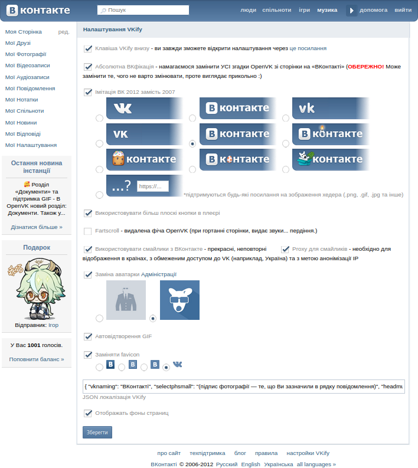
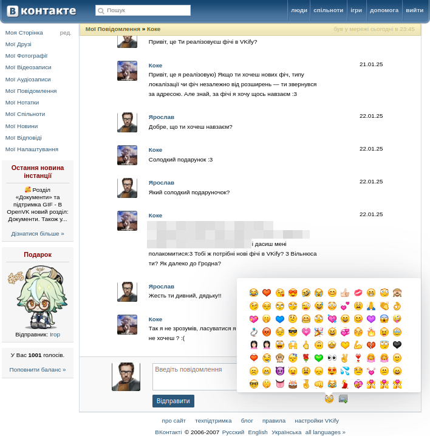

# VKify
VKify — userscript и usercss, которая позволяет насколько возможно OpenVK к виду ВКонтакте 2007-х
## Функционал
- Заменить все упоминания OpenVK на ВКонтакте 
   **Внимание: используйте эту функцию с осторожностью: она может заменить то, чего не стоит**
- Изменяет стандартные смайлики twemoji на смайлики из ВКонтакте
   Смайлики загружаются из серверов ВКонтакте. Если в вашей стране ограничен доступ к ВКонтакте или же вы желаете скрыть IP от серверов VK, используйте проксирование
- Заменить шапку на кастомную (пасхальную, с другим видом логотипа или вашу)
- Заменить аватарку [Администрации](https://ovk.to/id100)
- Замена стандартной иконки на альтернативную (на оригинальную из ВК, например)
- И многое другое
  #### Предложение? Рады увидеть ваши предложения в [issues](https://github.com/koke228666/VKify/issues)!
## Скриншоты

  
  

  

## Установка

1. Для использования расширения, вам необходимо иметь установленным:
- [Tampermonkey](https://www.tampermonkey.net/?locale=ru) 
- [Stylus](https://add0n.com/stylus.html)
    Учите: если ваш браузер Chrome-based (Chrome, Microsoft Edge и так далее), важно [выполнить инструкцию](https://www.tampermonkey.net/faq.php#Q209), иначе вы будете иметь риск неработоспособности
2. [Измените](https://ovk.to/settings?act=interface) тему на "ВКонтакте 2007", в настройках VKify вы сможете адаптировать её под тему ВКонтакте 2012
3. Перейдите по следующим ссылкам:
   [Установка скрипта](https://raw.githubusercontent.com/koke228666/VKify/refs/heads/main/vkify.user.js)
   [Установка стиля](https://raw.githubusercontent.com/koke228666/VKify/refs/heads/main/vkify.user.css)
#### Et voilà!
